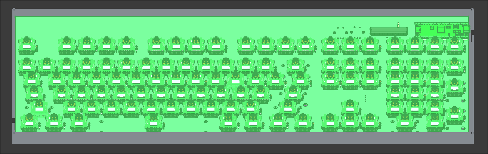
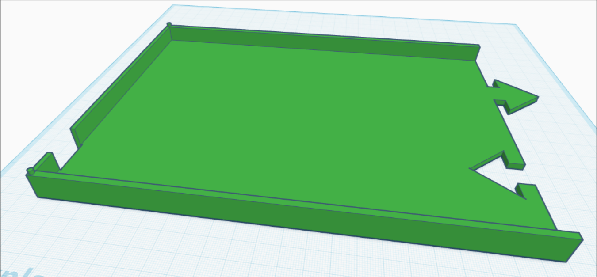
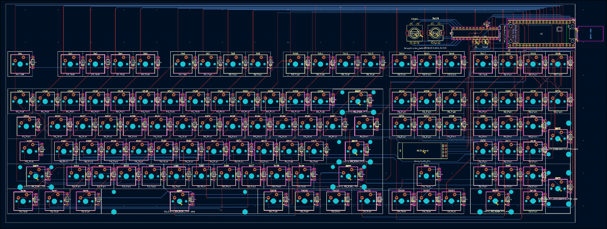

# full-keyboard
This is a 108 key keyboard that follows the ansi 104 key layout with 4 extra keys above the numpad. It has spots for two rotary encoders and a oled but to start i am going to not include those to reduce cost.

I wanted to make this to allow me to try a mechanical keyboard without needing to spend $200+ for a lowend mechanical keyboard and to give a chance to use QMK firmware.

To make this keyboard for your self upload the gerbers in [/PCB](/PCB) to your prefered pcb site. case is designed to be 3d printed both sides are the same part so just print the 3d model in [/CAD](/CAD) twice then rotate to fit. firmware is built like any qmk firmware. instructions are in the folder as well. other parts are listed below and in BOM.csv

BOM:
| Item Count | item name                    | Unit price $ | Total Price* | Price with discounts* | Link                                                                                                                           | Running total $* | Running total with coupons* | part number | Notes                                               | *Rounded to two decimal places |
|------------|------------------------------|--------------|--------------|-----------------------|--------------------------------------------------------------------------------------------------------------------------------|------------------|-----------------------------|-------------|-----------------------------------------------------|--------------------------------|
| 1          | Raspi pico                   | 5            | 5            | 5                     | https://www.adafruit.com/product/5525                                                                                          | 5.3              | 5.3                         | 1           |                                                     |                                |
| 0          | MCP23017-E/SP                | 2.8633       | 0            | 0                     | https://www.lcsc.com/product-detail/C647352.html                                                                               | 5.3              | 5.3                         | 2           |                                                     |                                |
| 0          | DUROCK MX Hotswap PCB Socket | 12.99        | 0            | 0                     | https://www.amazon.com/DUROCK-Mechanical-Keyboard-Switches-Hot-Swap/dp/B0B4W9YMGM                                              | 5.3              | 5.3                         | 3           | comes in a pack of 110 sockets                      |                                |
| 110        | 1N4148-t50A diode            | 0.0338       | 3.72         | 3.72                  | https://www.digikey.com/en/products/detail/onsemi/1N4148-T50A/978509                                                           | 9.24             | 9.24                        | 4           | packs of 10                                         |                                |
| 0          | 4.7kΩ Resister               | 0.0104       | 0            | 0                     | https://www.lcsc.com/product-detail/C172560.html                                                                               | 9.24             | 9.24                        | 5           |                                                     |                                |
| 108        | keycaps                      | 0            | 0            | 0                     | https://www.printables.com/model/118708-simple-cherry-mx-keycap                                                                | 9.24             | 9.24                        | 6           | 1g each can print myself                            |                                |
| 1          | mx style Blue Switches       | 29.07        | 29.07        | 6.07                  | https://www.aliexpress.us/item/3256805690299829.html                                                                           | 40.05            | 15.67                       | 7           | pack of 108 price                                   |                                |
| 0          | rotary encoder               | 2.0254       | 0            | 0                     | https://www.lcsc.com/product-detail/C470754.html?s_z=n_EC11                                                                    | 40.05            | 15.67                       | 8           |                                                     |                                |
| 1          | PCB mount stabalizers        | 7.74         | 7.74         | 7.74                  | https://www.aliexpress.us/item/3256808425761333.html                                                                           | 48.25            | 23.87                       | 9           | 100% kit                                            |                                |
| 1          | PCB                          | 40.5         | 40.5         | 40.5                  | https://www.jlcpcb.com                                                                                                         | 91.18            | 66.8                        | 10          | jlcpcb price is cheaper then pcbway before shipping |                                |
| 0          | oled display                 | 2.43         | 0            | 0                     | https://www.aliexpress.us/item/3256808041069220.html                                                                           | 91.18            | 66.8                        | 11          |                                                     |                                |
| 0          | pin header for oled          | 0.3233       | 0            | 0                     | https://www.lcsc.com/product-detail/C19795120.html                                                                             | 91.18            | 66.8                        | 12          | packs of 5                                          |                                |
| 0          | 100nF cap                    | 0.4264       | 0            | 0                     | https://www.lcsc.com/product-detail/C1622885.html                                                                              | 91.18            | 66.8                        | 13          |                                                     |                                |
| 1          | case                         | 0            | 0            | 0                     | https://www.tinkercad.com/things/01yfcJqc3YT-ingenious-bigery-lappi/edit?sharecode=nC_VnJf1HsXTyW1O5QeXRIFHX63alX2Tb5NiMYivruU | 91.18            | 66.8                        | 14          | print my self/make out of cardboard                 |                                |
| 1          | Shipping for PCB             | 22.89        | 22.89        | 22.89                 | N/A                                                                                                                            | 115.44           | 91.06                       |             |                                                     |                                |
| 1          | digikey shipping and tarrifs | 5.36         | 5.36         | 5.36                  |                                                                                                                                | 121.12           | 96.74                       |             | ±$5                                                 |                                |
| 1          | Adafruit shipping            | 5.41         | 5.41         | 5.41                  |                                                                                                                                | 126.85           | 102.47                      |             |                                                     |                                |
| 1          | aliexpress shipping          | 0            | 0            | 0                     |                                                                                                                                | 126.85           | 102.47                      |             | over min amount for free shipping                   |                                |
