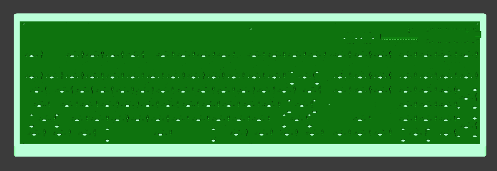
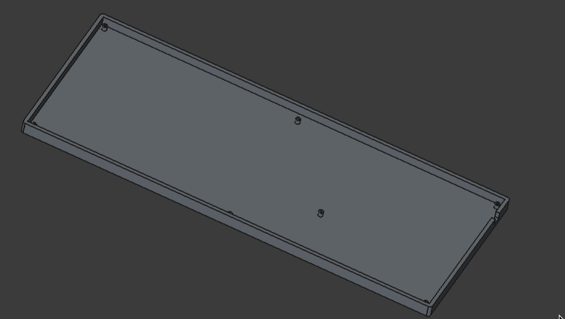
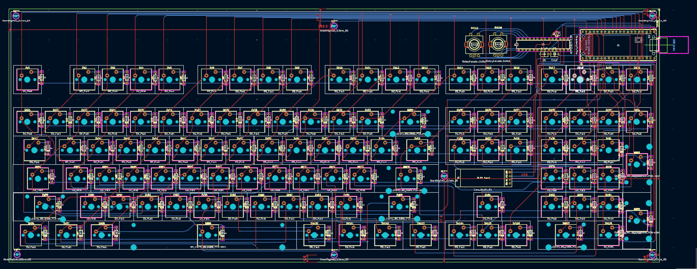

# full-keyboard
This is a 108 key keyboard that follows the ansi 104 key layout with 4 extra keys above the numpad. It has spots for two rotary encoders and a oled but to start i am going to not include those to reduce cost.

I wanted to make this to allow me to try a mechanical keyboard without needing to spend $200+ for a lowend mechanical keyboard and to give a chance to use QMK firmware.

To make this keyboard for your self upload the gerbers in [/PCB](/PCB) to your prefered pcb site. the case is split into 2 parts the files are in [/CAD](/CAD). firmware is built like any qmk firmware. instructions are in the folder as well. other parts are listed below and in BOM.csv and BOM.ods

Fully soldered keyboard (just need to get the case and keycaps).

BOM:
| Item Count | item name                    | Unit price $ | Total Price* | Price with discounts* | Link                                                            | Running total $* | Running total with coupons*    | part number | Notes                                                             |
|------------|------------------------------|--------------|--------------|-----------------------|-----------------------------------------------------------------|------------------|--------------------------------|-------------|-------------------------------------------------------------------|
| 1          | Raspi pico                   | 5            | 5            | 5                     | https://www.adafruit.com/product/5525                           | 5.3              | 5.3                            | 1           |                                                                   |
| 110        | 1N4148-t50A diode            | 0.0307       | 3.38         | 3.38                  | https://www.lcsc.com/product-detail/C895215.html                | 8.88             | 8.88                           | 2           | packs of 10                                                       |
| 108        | keycaps                      | 0            | 0            | 0                     | https://www.printables.com/model/118708-simple-cherry-mx-keycap | 8.88             | 8.88                           | 3           | 1g each can print myself                                          |
| 1          | Outemu(Gaote) Blue Switches  | 21.99        | 21.99        | 21.99                 | https://www.amazon.com/gp/product/B0CBSL2Z75                    | 32.19            | 32.19                          | 4           | pack of 108 price                                                 |
| 1          | DUROCK PCB mount stabalizers | 17.99        | 17.99        | 17.99                 | https://www.amazon.com/gp/product/B0B2RVN19F?psc=1              | 51.26            | 51.26                          | 5           | full set                                                          |
| 1          | heatset inserts              | 8.99         | 8.99         | 8.99                  | https://www.amazon.com/gp/product/B0CS6XJSSL                    | 60.79            | 60.79                          | 6           |                                                                   |
| 1          | PCB                          | 35.3         | 35.3         | 35.3                  | https://www.jlcpcb.com                                          | 98.21            | 98.21                          | 7           | jlcpcb price is cheaper then pcbway before shipping               |
| 1          | case                         | 0            | 0            | 0                     | N/A                                                             | 98.21            | 98.21                          | 8           | print using printing legion                                       |
| 1          | Shipping for PCB             | 41.4         | 41.4         | 22.16                 | N/A                                                             | 142.09           | 121.7                          |             | First shipping cost is for DHL express second one is for GDL      |
| 1          | digikey shipping and tarrifs | 5.36         | 5.36         | 5.36                  | N/A                                                             | 147.77           | 127.38                         |             | ±$5                                                               |
| 1          | Adafruit shipping            | 5.72         | 5.72         | 5.72                  | N/A                                                             | 153.83           | 133.44                         |             |                                                                   |
| 1          | amazon shipping              | 0            | 0            | 0                     | N/A                                                             | 153.83           | 133.44                         |             | over min amount for free shipping/have a 30 trial of amazon prime |
|            |                              |              |              |                       |                                                                 |                  |                                |             |                                                                   |
|            |                              |              |              |                       |                                                                 |                  | *Rounded to two decimal places |             |                                                                   |

